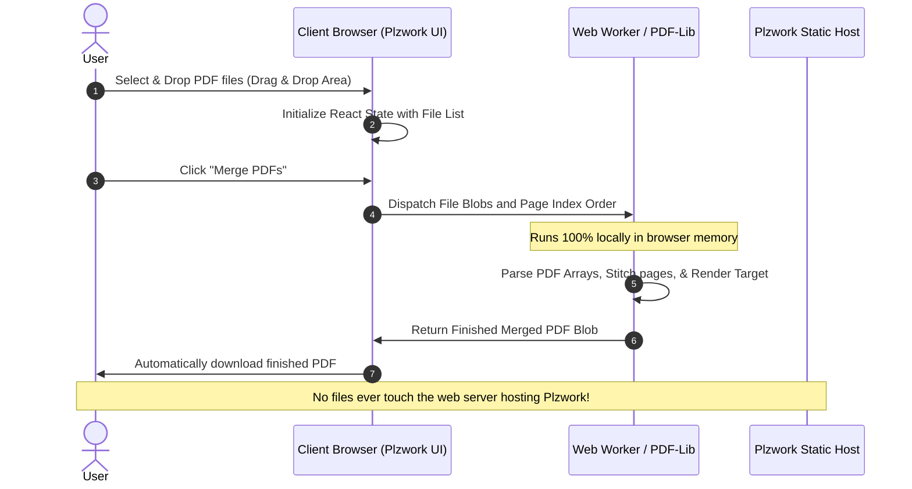
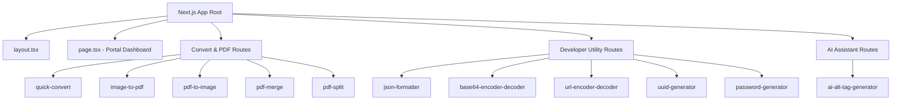
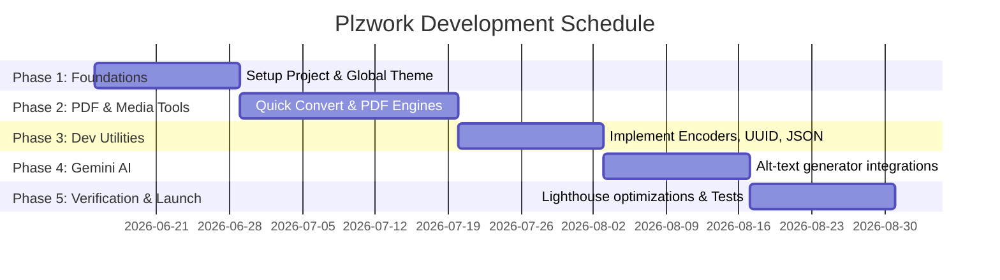

# Final Year Project Proposal
## Project Title: Plzwork – A Privacy-First, Client-Side Utility and AI Workflow Suite

### 1. Project Overview & Abstract
In the modern digital workspace, users frequently interact with administrative, development, and media tasks such as document merging, format converting, string manipulation, and metadata generation. Existing online utility tools often demand server-side file uploads, raising significant data privacy concerns, introducing server bandwidth costs, and subjecting users to upload limits, advertisements, and subscription walls.

**Plzwork** is a suite of focused, high-performance, and privacy-first tools designed to streamline daily workflows for developers, designers, content creators, and power users. By executing 100% of processing client-side in the user's browser, Plzwork guarantees that sensitive files, credentials, and documents never egress. The system integrates advanced PDF compiling, image processing, development text helpers, and local integrations with Google's Gemini models for AI workflows, providing a seamless, secure, and modern workspace dashboard.

---

### 2. Introduction & Problem Statement
Most casual and professional web-users rely on free web services (e.g., PDF splitters, converters, formatters) for quick daily adjustments. However, these websites present three core vulnerabilities:
1. **Security & Privacy Risks:** Users must upload raw PDFs (often containing financial data, identity records, or private information) and code snippets (which may contain API keys, sensitive customer data, or proprietary algorithms) to third-party servers.
2. **Performance Constraints:** Server-side file conversion introduces latency due to network upload and download times, coupled with queue wait times. Large file sizes are typically blocked by upload limits.
3. **Obtrusive User Experience:** Many sites are bloated, use heavy ad networks, require signups to access basic tools, or lock features behind recurring paywalls.

**Plzwork** addresses these challenges by moving processing workloads directly to the client's browser, utilizing modern Web APIs (such as Web Workers, Canvas, and browser-native encryption/decryption modules) to achieve high-performance results without server overhead.

---

### 3. Project Objectives
* **Absolute Client-Side Sandboxing:** Deliver zero-server storage utility operations. All files processed (including PDF compiles, HEIC decodes, and file conversions) must be processed entirely inside the client browser.
* **Aggregated Development and Creative Suite:** Provide a centralized dashboard containing 12 distinct tools covering file formatting, document manipulation, developer encoders/decoders, and AI integrations.
* **Exceptional UI/UX Design:** Develop a responsive, fluid grid interface using dark mode-first colors, glassmorphic menus, micro-animations, and smooth drag-and-drop operations.
* **Lightweight AI Orchestration:** Enable edge-ready metadata and alt-text generation by integrating the Google Gemini SDK directly from client-side execution, bypassing the need for an intermediate API proxy.
* **Modern Developer Standard:** Built on Next.js 15, React, Tailwind CSS v4, and TypeScript, establishing a reusable boilerplate for modular utilities.

---

### 4. Technical Architecture & Technology Stack
Plzwork is designed with a serverless-client architecture, shifting the processing load entirely to the user's machine:

| Component | Technology | Rationale |
| :--- | :--- | :--- |
| **Frontend Framework** | Next.js 15 (React 19 / App Router) | Standard-setting routing, component structure, SEO, and fast developer reload via Turbopack compiler. |
| **Language** | TypeScript | Ensures robust compile-time type-safety, minimizing runtime errors during binary array conversions. |
| **Styling** | Tailwind CSS v4 & PostCSS | Dynamic grid alignments, smooth custom animations, responsive flexboxes, and dark-theme variables. |
| **PDF Processing Engine** | `pdf-lib` & `pdfjs-dist` | In-browser PDF compilation and PDF page rendering as high-quality image assets. |
| **Image & Media Decoders** | `heic2any` & Canvas APIs | Client-side conversion of Apple HEIC images and local compression adjustments. |
| **File Compression & Output** | `jszip` & `file-saver` | Compiles bulk processed assets into standard compressed archives (`.zip`) instantly. |
| **Drag-and-Drop Library** | `@dnd-kit/core` & `@dnd-kit/sortable` | Smooth reordering of pages/images in bulk merges. |
| **AI Integration API** | `@google/genai` (Gemini SDK) | Direct SDK communication with high-performance Gemini models using client-managed API keys. |

---

### 5. System Design & Data Flow Diagrams

#### A. Client-Side Document Processing Sequence Diagram
The sequence below illustrates the client-side lifecycle of document processing (e.g., merging PDFs) that prevents data upload:

#### B. Component and Routes Structure
The architecture follows Next.js App Router folders, keeping the tools isolated and modular:

---

### 6. Functional Description of Key Modules
The utility suite is partitioned into three main logical modules:

#### Module A: Convert & PDF Tools
1. **Quick Convert (Image Converter):** Client-side image converter handling PNG, JPEG, WebP, and Apple HEIC formats. Incorporates compression and quality parameters.
2. **Image to PDF:** Packages list of inputs (JPG, PNG, WebP) into an A4/custom formatted PDF.
3. **PDF to Image:** Extracts and converts pages of a PDF document into independent image assets.
4. **Merge & Split PDF:** Enables merging via dragging/dropping specific PDF sheets, and splitting via custom page range inputs.

#### Module B: Developer Utilities
1. **JSON Formatter:** Formats, beautifies, validates, and minifies JSON files.
2. **Base64 / URL Encoder & Decoder:** Securely handles credential/string configurations client-side.
3. **UUID Generator:** Generates bulk standard RFC4122 v4 UUID identifiers.
4. **Password Generator:** Employs cryptographically secure pseudo-random generators (`window.crypto`) to output high-entropy passwords.

#### Module C: AI Workflows
1. **Alt-Text Generator:** Utilizes Gemini 2.5/Flash multimodal capabilities to analyze uploaded image structures and generate accessible metadata and ALT attributes. The user inputs their API key locally, stored in the browser's session storage.

---

### 7. Implementation Plan & Timeline
The project development lifecycle spans 12 weeks:

---

### 8. Security & Privacy Safeguards
> [!IMPORTANT]
> The central value proposition of Plzwork is its **Zero-Data-Storage** architecture. Traditional utility tools store temporary files on cloud disk partitions, creating a severe threat vector.

* **Local Buffer Sandboxing:** File buffers are loaded straight into JavaScript variables in memory and immediately garbage-collected upon completion.
* **Local Storage Credentials:** API Keys for AI tools are saved only to `sessionStorage` or local memory, preventing unauthorized key retrieval.
* **No Network Side-Effects:** Since Next.js is configured for static client export, there is no Node.js backend acting as a proxy that could cache files.

---

### 9. Expected Outcomes & Evaluation Metrics
To measure the project's success, the application will be validated using three groups of metrics:

1. **Performance Metrics:**
   - **Page Load (LCP):** Less than 1.5 seconds.
   - **Local Conversion Latency:** Processing of a 10MB HEIC image should execute under 3 seconds on standard mobile/desktop hardware.
   - **Maximum File Limit Support:** Stable processing of up to 100MB PDF inputs without browser crash.

2. **Security Compliance:**
   - Zero outbound requests containing file byte-arrays or user-entered text payloads (verified via browser network-tab auditing).

3. **SEO & Accessibility Metrics:**
   - Perfect or near-perfect Lighthouse scores (Accessibility: >95, SEO: >95).
   - Valid JSON-LD structured semantic schemas on routing directories.

---

### 10. Conclusion & Future Scope
Plzwork resolves the compromise between convenience and security. By delivering desktop-app-level processing speed inside a standard browser environment, it provides an invaluable toolset for developers and power users. 

**Future Roadmap Goals:**
* **Modular NPM Packages for Developer Repositories:** Package the core algorithmic engines of Plzwork into lightweight, tree-shakable, open-source NPM packages. This will enable external web developers to import client-side utilities directly into their own React/Next.js/Vue/Vanilla JS codebases:
  - `@plzwork/pdf-core`: High-level client-side PDF merging, splitting, and rendering utilities built on top of `pdf-lib` and `pdfjs-dist`.
  - `@plzwork/image-convert`: Client-side batch image resizing, quality compression, and HEIC decoding.
  - `@plzwork/crypto-utils`: Cryptographically secure browser-native random string, password, and UUID generation.
* **SVG Optimization & Minifiers:** Integration of SVG cleaning algorithms (removing XML headers, editor metadata) and JavaScript/CSS code minifiers.
* **Native OS Folder Syncing:** Leverage the Web File System Access API to allow users to select local directories for automatic bulk conversions and processing.
* **FFmpeg.wasm Integration:** Support local, multi-threaded WebAssembly-compiled media decoders for in-browser video trimming and audio extracting without server bandwidth consumption.
